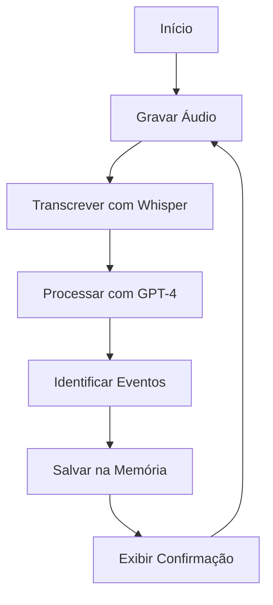

# 🧠 Agente de Memória - Agent Memory

## 📋 Sobre o Projeto

O **Agente de Memória** é um assistente inteligente que funciona como seu "assistente virtual", capaz de:
- 🎤 Gravar áudio através do microfone
- 📝 Transcrever sua fala usando IA (Whisper da OpenAI)
- 🤖 Processar e registrar os eventos descritos no áudio usando GPT-4
- 💾 Salvar tudo em uma memória persistente para consultas futuras

Este projeto é perfeito para **iniciantes em Python e IA** que querem entender como integrar diferentes tecnologias de inteligência artificial.

## 🚀 O que você vai aprender

- Como usar APIs da OpenAI (Whisper para transcrição e GPT-4 para processamento)
- Manipulação de arquivos de áudio em Python
- Gerenciamento de variáveis de ambiente
- Conceitos básicos de Agentes de IA


## Glossário de termos mencionados no curso

**Algoritmos**: Sequência de instruções organizadas e lógicas para resolver um problema específico. É como uma "receita" que o computador segue passo a passo para executar uma tarefa, desde as mais simples até as mais complexas.

**Fetch**: Função usada para fazer requisições HTTP e buscar dados de servidores ou APIs. Permite que uma página web solicite informações de outros lugares na internet de forma assíncrona, sem precisar recarregar a página.

**API Whisper**: Serviço de inteligência artificial da OpenAI que converte áudio em texto (transcrição). É capaz de reconhecer fala em diversos idiomas e transformar gravações de voz em texto escrito.

**venv**: Ferramenta do Python que cria ambientes virtuais isolados. Permite instalar bibliotecas específicas para cada projeto sem afetar outras aplicações, mantendo as dependências organizadas e separadas.

**requirements.txt**: Arquivo de texto que lista todas as bibliotecas e suas versões necessárias para um projeto Python funcionar. Facilita a instalação das dependências em outros computadores ou ambientes.

**PyAudio**: Biblioteca Python que permite gravar e reproduzir áudio. É usada para capturar som do microfone ou tocar arquivos de áudio diretamente através do código Python.

**Wave**: Módulo Python nativo para trabalhar com arquivos de áudio no formato WAV. Permite ler, escrever e manipular arquivos de som sem precisar instalar bibliotecas externas.

**python-dotenv**: Biblioteca que carrega variáveis de ambiente a partir de um arquivo .env. É útil para manter informações sensíveis como chaves de API separadas do código principal.

**OpenAI**: Biblioteca oficial da OpenAI para Python que facilita a integração com seus serviços de IA, como GPT e Whisper. Permite fazer chamadas para as APIs da empresa de forma simples.

**Playsound**: Biblioteca Python simples para reproduzir arquivos de áudio. Oferece uma maneira fácil de tocar sons em aplicações sem configurações complexas.

**Pydantic**: Biblioteca Python para validação de dados usando type hints. Garante que os dados estejam no formato correto e ajuda a detectar erros antes que causem problemas na aplicação.

**Eventos**: Ações ou ocorrências que acontecem durante a execução de um programa, como cliques do mouse, pressionamento de teclas ou chegada de dados. O programa pode "escutar" esses eventos e reagir a eles.

**LangChain**: Framework Python para desenvolver aplicações com modelos de linguagem (LLMs). Facilita a criação de chatbots, sistemas de perguntas e respostas e outras aplicações de IA conversacional.


## 🛠 Tecnologias Utilizadas

- **Python 3.11+** - Linguagem principal
- **OpenAI API** - Para transcrição (Whisper) e processamento de linguagem natural (GPT-4)
- **PyAudio** - Para gravação de áudio
- **Pydantic** - Para validação e estruturação de dados
- **Python-dotenv** - Para gerenciamento de variáveis de ambiente

## 📁 Estrutura do Projeto

```
cw-academy/
│
├── agent-memory/              # Pasta principal do projeto
│   ├── main.py               # Script principal
│   ├── requirements.txt      # Dependências do projeto
│   ├── memory.json          # Arquivo de memória (criado automaticamente)
│   │
│   ├── utils/               # Utilitários
│   │   ├── record_audio.py  # Função para gravar áudio
│   │   └── basemodel2tool.py # Conversor de modelos Pydantic para tools OpenAI
│   │
│   └── tools/               # Ferramentas do agente
│       └── daily_events.py  # Modelo para eventos diários
│
├── venv/                    # Ambiente virtual Python
├── .gitignore              # Arquivos ignorados pelo Git
└── README.md               # Este arquivo
```

## ⚙️ Configuração do Ambiente

### 1. Clone o repositório
```bash
git clone <seu-repositorio>
cd cw-academy
```

### 2. Crie e ative o ambiente virtual
```bash
# Criar ambiente virtual
python -m venv venv

# Ativar ambiente virtual
# No macOS/Linux:
source venv/bin/activate
# No Windows:
venv\Scripts\activate
```

### 3. Instale as dependências
```bash
cd agent-memory
pip install -r requirements.txt
```

### 4. Configure a API Key da OpenAI

1. Crie uma conta na [OpenAI](https://platform.openai.com/)
2. Gere uma API Key no painel de controle
3. Crie um arquivo `.env` na pasta `agent-memory/`:

```bash
# Criar arquivo .env
touch .env
```

4. Adicione sua API Key no arquivo `.env`:
```
OPENAI_API_KEY=sua_chave_api_aqui
```

> ⚠️ **Importante**: Nunca compartilhe sua API Key! O arquivo `.env` já está no `.gitignore` para protegê-la.

## 🎯 Como Usar

### 1. Execute o programa
```bash
cd agent-memory
python main.py
```

### 2. Interaja com o agente

1. **Fale sobre seu dia**: O programa começará a gravar automaticamente
2. **Conte eventos**: Ex: "Hoje de manhã fui ao médico e à tarde tive uma reunião importante"
3. **Aguarde o processamento**: O agente irá transcrever e processar sua fala
4. **Veja o resultado**: Os eventos serão salvos e uma confirmação será exibida

### 3. Exemplo de uso
```
🎤 Gravando... (Fale sobre seus eventos do dia)

Você: "Hoje de manhã às 9h fui ao dentista, e à tarde às 15h tive uma reunião com o cliente João"

🤖 Agente: "Evento do dia 15/01/2024 registrado com sucesso, posso te ajudar com mais alguma coisa?"
```

## 📊 Como funciona internamente

### Fluxo do Programa



### Componentes Principais

1. **record_audio.py**: Grava áudio do microfone e salva como arquivo WAV
2. **main.py**: Loop principal que coordena todo o processo
3. **daily_events.py**: Modelo de dados para eventos diários
4. **memory.json**: Arquivo onde ficam salvos todos os eventos e interações

## 🔧 Personalização

### Adicionando novos tipos de eventos

1. Crie um novo modelo em `tools/`:
```python
from pydantic import BaseModel, Field

class TaskEvents(BaseModel):
    """Registra tarefas e compromissos"""
    date: str = Field(description="Data da tarefa")
    tasks: List[str] = Field(description="Lista de tarefas")
```

2. Importe e adicione ao `main.py`:
```python
from tools.task_events import TaskEvents
# Adicione na lista de tools
```

### Mudando o idioma

Para usar em inglês, altere no `main.py`:
```python
language="en"  # Linha da transcrição
```


## ❌ Solução de Problemas

### Erro de permissão do microfone
**macOS**: Vá em Configurações > Privacidade > Microfone e permita o acesso ao Terminal/Python

### Erro de instalação do PyAudio
**macOS**:
```bash
brew install portaudio
pip install pyaudio
```

**Ubuntu/Debian**:
```bash
sudo apt-get install portaudio19-dev
pip install pyaudio
```

### API Key inválida
- Verifique se a chave está correta no arquivo `.env`
- Confirme se há créditos na sua conta OpenAI

## 📚 Próximos Passos

Depois de dominar este projeto, você pode:

1. **Adicionar interface gráfica** com Tkinter ou Streamlit
2. **Integrar com calendário** (Google Calendar API)
3. **Adicionar busca por eventos** por data ou palavra-chave
4. **Implementar classificação automática** de eventos por categoria
5. **Criar relatórios** semanais ou mensais
6. **Adicionar lembretes** automáticos

## 🤝 Contribuição

Este é um projeto educacional! Sinta-se à vontade para:
- Fazer fork do projeto
- Propor melhorias
- Reportar bugs
- Adicionar novas funcionalidades

## 📄 Licença

Projeto desenvolvido para fins educacionais. Use, modifique e compartilhe livremente!

---

💡 **Dica**: Este projeto é uma excelente introdução ao mundo dos Agentes de IA. Continue explorando e criando!
